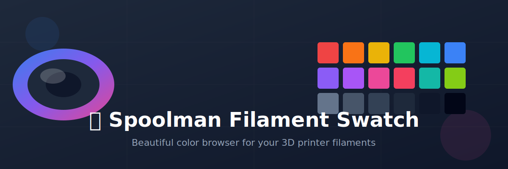

<div align="center">



# 🎨 Spoolman Filament Swatch

[](https://spoolswatch.disane.dev/)
[](LICENSE)
[](https://github.com/Disane87/spoolman-filament-swatch/stargazers)

</div>

---

Hey there! 👋 This is a beautiful, interactive filament color browser for [Spoolman](https://github.com/Donkie/Spoolman/) - the awesome open-source filament inventory management system. 

Think of it as your personal filament showroom - browse colors, filter by material, vendor, location, and find that perfect filament for your next print! 🖨️✨

> **Note:** This is a companion app for Spoolman. You'll need a running [Spoolman](https://github.com/Donkie/Spoolman/) instance to manage your filaments, or you can browse the external community database without Spoolman.

## 🌐 Live Demo

Want to see it in action? Check out the live demo:

**🚀 [https://spoolswatch.disane.dev/](https://spoolswatch.disane.dev/)**

> [!NOTE]
> On first visit, you'll need to enter your Spoolman server URL. The app stores this in your browser's local storage - we don't collect or store anything on our servers!

## ✨ What Can This Thing Do?

Glad you asked! Here's the good stuff:

- 🎨 **Beautiful Color Display**: See your filaments with their actual colors in a stunning grid or carousel view
- 🔍 **Smart Filtering**: Filter by vendor, material, color type (single/multi-color), location, and source
- 📍 **Location Tracking**: See exactly where your spools are stored
- ⚖️ **Remaining Weight**: Track how much filament you have left on each spool
- 🌈 **Multi-Color Support**: Full support for multi-color filaments with visual indicators
- 🎯 **Color Palette**: Click through an interactive color map to find specific colors
- 📱 **Responsive Design**: Works great on desktop, tablet, and mobile
- 🌍 **Multi-Language**: Available in English and German
- 🌙 **Dark/Light Mode**: Choose your preferred theme
- 🔖 **Pin Favorites**: Create a custom palette by pinning your favorite filaments
- 🔗 **Deep Linking**: Share searches with URL parameters (e.g., `?v=prusament&m=petg`)
- 💾 **Local First**: All settings stored in your browser - no cloud, no tracking
- 🚀 **External Database**: Browse filaments from the community database even without Spoolman

## 🚀 Getting Started

Using the live version is super easy:

1. Visit **[https://spoolswatch.disane.dev/](https://spoolswatch.disane.dev/)**
2. Enter your Spoolman server URL (e.g., `http://localhost:7912`)
3. Start browsing your filaments! 🎉

> [!TIP]
> The URL is only stored in your browser's local storage. You can change it anytime by clicking the edit button in the footer.

### ⚠️ CORS Configuration Required

When using the deployed version (not localhost), you need to configure CORS on your Spoolman server to allow requests from `https://spoolswatch.disane.dev`.

**Add this to your Spoolman configuration:**

```env
SPOOLMAN_CORS_ORIGIN=spoolswatch.disane.dev
```

For multiple origins (comma-separated, **NO SPACES**):

```env
SPOOLMAN_CORS_ORIGIN=spoolswatch.disane.dev,localhost:5173
```

> [!IMPORTANT]
> Do NOT include the protocol (`https://` or `http://`). Use only the domain: `spoolswatch.disane.dev` NOT `https://spoolswatch.disane.dev`

**Where to add this:**
- **Docker**: Add to your `docker-compose.yml` under `environment:` or in your `.env` file
- **Direct installation**: Add to your `.env` file in the Spoolman directory

**After changing the configuration, you MUST restart Spoolman:**
- Docker: `docker-compose restart` or `docker restart spoolman`
- Direct: Restart the Spoolman service

> [!NOTE]
> This is only required when accessing the app from a different domain than your Spoolman server. Local development automatically uses a proxy to avoid CORS issues.

#### 🔧 Troubleshooting CORS Issues

If you still get CORS errors after configuring `SPOOLMAN_CORS_ORIGIN`:

1. **Verify Spoolman was restarted**: `docker logs spoolman | grep CORS` should show your origins
2. **Check for typos**: No spaces, correct protocol (`https://` vs `http://`)
3. **Verify the ENV variable is loaded**: `docker exec spoolman env | grep CORS`

**Alternative Solutions:**

- **Use the `surl` parameter**: Share links like `https://spoolswatch.disane.dev/?surl=http://your-spoolman:7912`
- **Self-host this app**: Clone and deploy it on the same domain as your Spoolman instance
- **Use a reverse proxy**: Configure nginx/traefik to serve both Spoolman and this app from the same domain
- **Browser extension**: Use a CORS unblock extension (not recommended for security reasons)

**If CORS configuration doesn't work**, the most reliable solution is to self-host this app or use the local development version.

## 🏃‍♂️ Running Locally

Want to run it on your own machine? No problem!

```bash
# Clone the repo
git clone https://github.com/Disane87/spoolman-filament-swatch.git
cd spoolman-filament-swatch

# Install dependencies
npm install

# Start the dev server
npm run dev

# Build for production
npm run build
```

The app will be available at `http://localhost:5173`

## 🎯 Features in Detail

### 📊 Two View Modes

- **Board View**: Grid layout showing all filaments at once - perfect for getting an overview
- **Carousel View**: Swipeable cards with detailed information - great for browsing one-by-one

### 🔍 Powerful Filtering

- **Search**: Type to search by name, vendor, material, or color code
- **Vendor**: Filter by manufacturer (Prusament, eSUN, etc.)
- **Material**: Filter by type (PLA, PETG, ABS, TPU, etc.)
- **Color Type**: Show only single-color or multi-color filaments
- **Location**: See filaments at specific storage locations
- **Source**: Toggle between Spoolman spools and external database
- **Color Palette**: Click on any color in the palette to filter

### 🎨 Color Map

The color map shows all unique colors in your collection, sorted by brightness. Click any color to filter your filaments - perfect for finding that exact shade you need!

### 📍 Location Awareness

If you track spool locations in Spoolman, you'll see:
- All locations where a filament is stored
- Total remaining weight across all spools of that filament
- Number of spools available

### 🔖 Pin Your Favorites

Building a custom palette? Pin your favorite filaments and they'll be collected in a convenient drawer:
- Click the pin icon on any filament card
- View all pinned items in the palette drawer
- Scroll to pinned items in the board view
- Clear all pins with one click

### 🌐 External Database

Don't have Spoolman yet? No worries! The app includes access to a community database of filaments. You can browse colors and specifications even without connecting to a Spoolman instance.

## 🔗 URL Parameters

Share specific searches with these URL parameters:

- `?q=search+term` - Pre-fill search
- `?v=vendor` - Pre-select vendor (e.g., `?v=prusament`)
- `?m=material` - Pre-select material (e.g., `?m=petg`)
- `?c=%23ff0000` - Pre-select color (URL-encoded hex)
- `?l=location` - Pre-select location
- `?surl=http://your-server:7912` - Set Spoolman URL (overrides saved URL)

Combine multiple parameters:
```
https://spoolswatch.disane.dev/?surl=http://spoolman.local:7912&v=prusament&m=petg
```

> [!TIP]
> Use the `surl` parameter to share direct links to your Spoolman instance with specific filters!

## 🛠️ Technology Stack

Built with modern web technologies:

- **Vue 3** - Progressive JavaScript framework
- **TypeScript** - Type-safe development
- **Vite** - Lightning-fast build tool
- **Tailwind CSS 4** - Utility-first styling
- **Vue I18n** - Internationalization
- **Reka UI** - Accessible UI components

## 🌍 Supported Languages

- 🇬🇧 English
- 🇩🇪 German

Want to add your language? Contributions are welcome! Check out the `src/locales/` folder.

## 🎨 Screenshots

> [!NOTE]
> Screenshots coming soon! For now, check out the [live demo](https://spoolswatch.disane.dev/) to see it in action.

## 🤝 Contributing

Hey there! Want to help make this app even better? That's awesome! 🎉

We'd love to have you on board! Here's how:

1. 🍴 Fork the repository
2. 🌿 Create a feature branch (`git checkout -b feature/amazing-feature`)
3. 💻 Make your changes
4. 🧪 Test thoroughly
5. 💾 Commit using conventional commits (`git commit -m 'feat: add amazing feature'`)
6. 🚀 Push to your fork (`git push origin feature/amazing-feature`)
7. 🎯 Open a Pull Request

### 💡 Ideas for Contributions

- 🌍 Add translations for more languages
- 🎨 Improve the UI/UX
- 🐛 Fix bugs or issues
- 📝 Improve documentation
- ✨ Add new features
- 🧪 Add tests

Don't be shy - we're all learning together! If you have questions, just open an issue and let's chat! 💬

## 🔗 Related Projects

- **[Spoolman](https://github.com/Donkie/Spoolman/)** - The awesome filament manager this app connects to
- **[Spoolman Home Assistant](https://github.com/Disane87/spoolman-homeassistant)** - Integrate Spoolman with Home Assistant

## 📝 License

This project is licensed under the MIT License - see the [LICENSE](LICENSE) file for details.

## 🎉 Cheers!

Thanks for checking out this project! If you like it, give it a ⭐ on GitHub - it really helps! 🙌

Found a bug? Have an idea? [Open an issue](https://github.com/Disane87/spoolman-filament-swatch/issues) and let's make this better together! 🚀

## 🙏 Acknowledgments

This project wouldn't exist without:

- **[Spoolman](https://github.com/Donkie/Spoolman/)** by [Donkie](https://github.com/Donkie) - The amazing filament management system that powers this app. Seriously, go check it out and give it a star! ⭐
- The entire 3D printing community for inspiration and feedback
- All contributors who help make this project better

If you're using this app, you should definitely be using Spoolman too. It's the backbone that makes filament tracking actually useful!

---

Made with ❤️ for the 3D printing community
